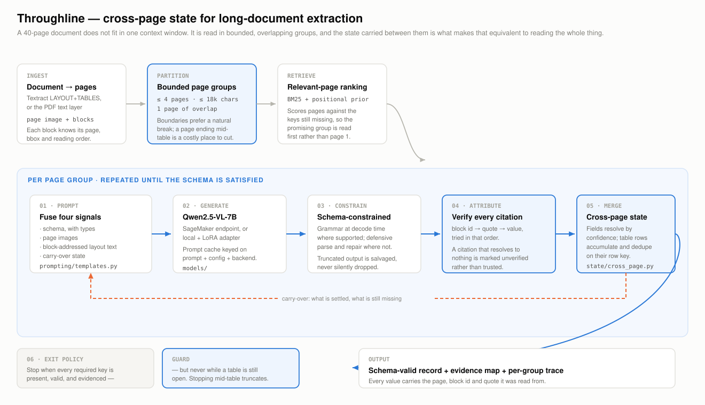
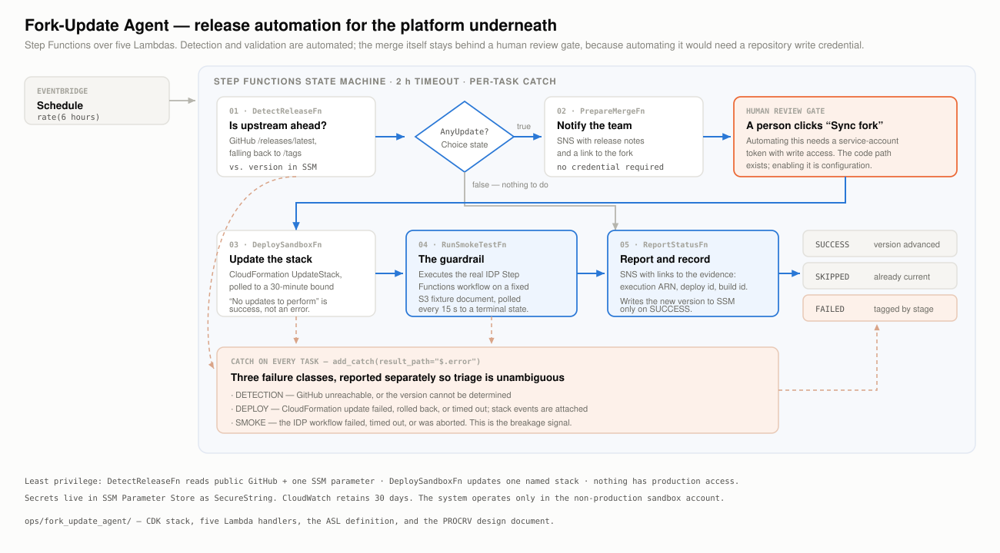
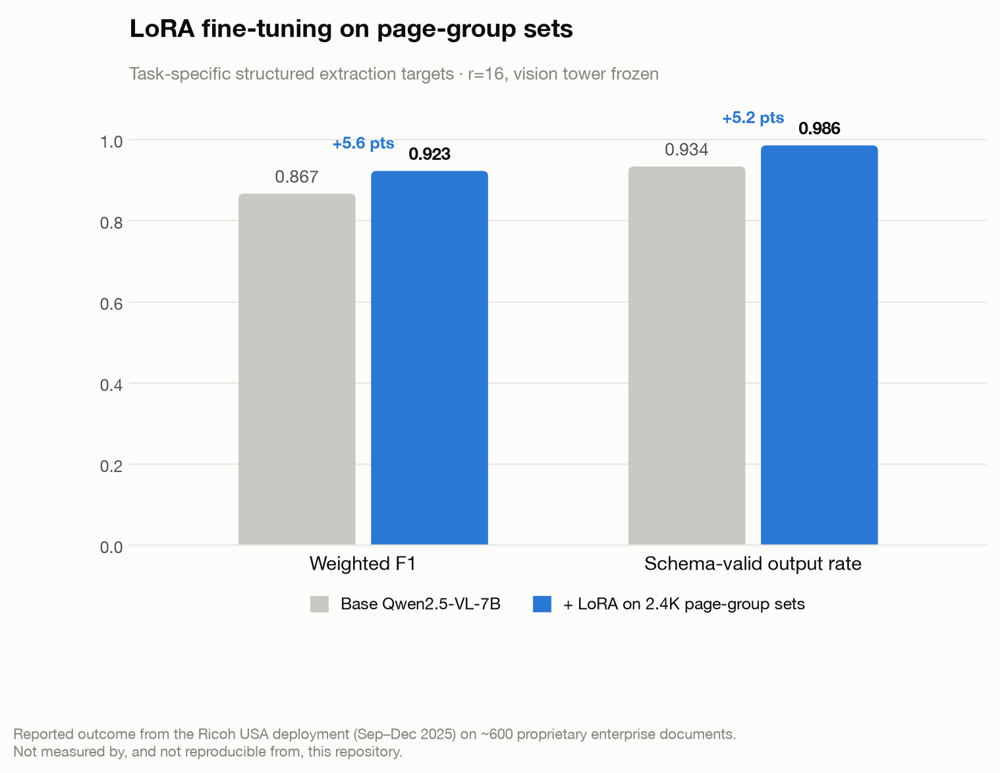
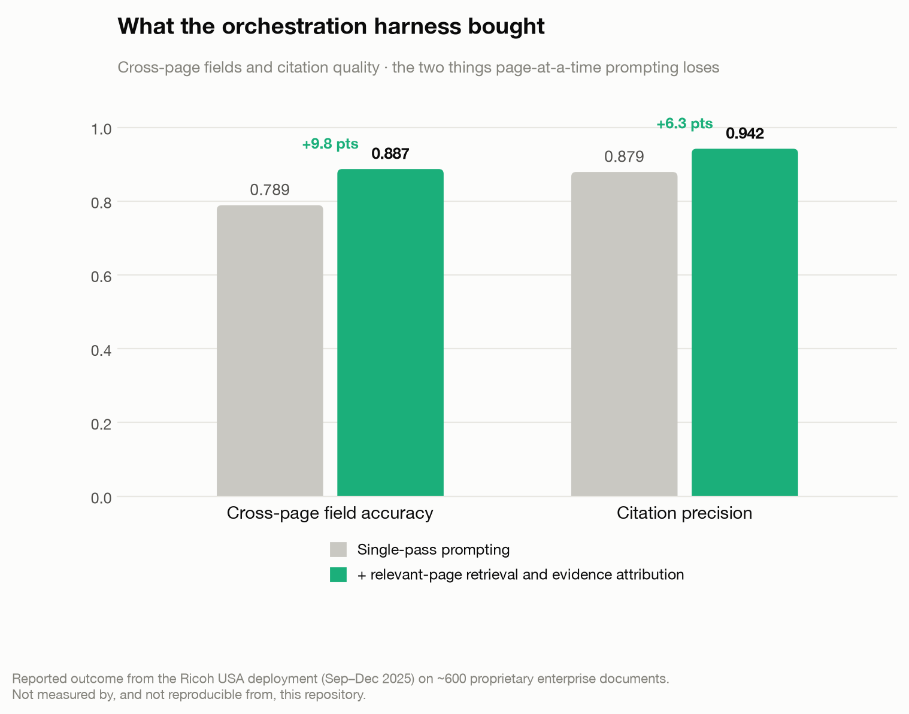
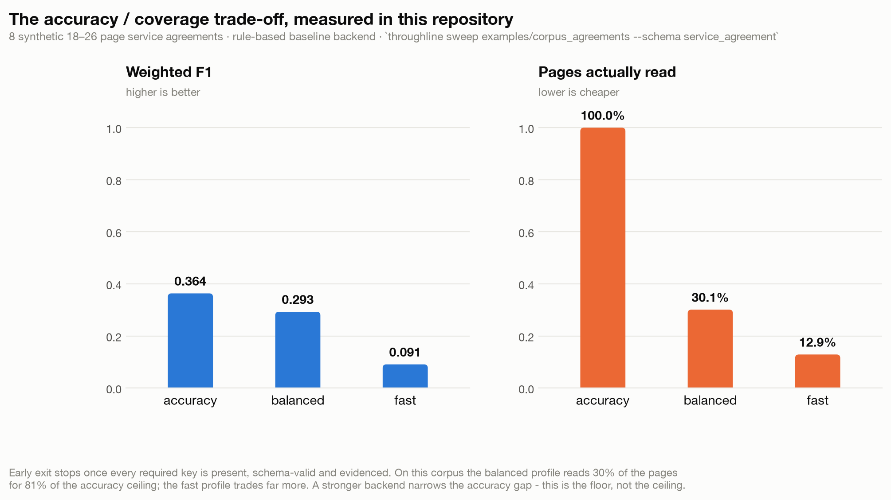

<div align="center">

<br>

# Throughline

### Cross-page state for long-document multimodal extraction

<br>

**AI/Machine Learning Engineer Intern · Ricoh USA, Inc.**
<br>
Atlanta, GA · September – December 2025

<br>

A long-document extraction system built on the AWS GenAI IDP accelerator, and the
release-automation agent that keeps the platform underneath it current.

<br>

[](pyproject.toml)
[](src/throughline/models/qwen_vl.py)
[](src/throughline/models/sagemaker.py)
[](src/throughline/ingest/ocr.py)
[](ops/fork_update_agent)
[](src/throughline/evaluation/mlflow_tracking.py)
[](tests)
[](pyproject.toml)

<br>

**[Overview](#the-internship-in-one-page)** ·
**[Part I — Extraction](#part-i--throughline-the-extraction-system)** ·
**[Part II — Release automation](#part-ii--the-fork-update-agent)** ·
**[Results](#results)** ·
**[Quickstart](#quickstart)** ·
**[Docs](#documentation)**

</div>

<br>

---

## The internship in one page

Ricoh's Design and Product teams run pre-sales document-extraction demos on a sandbox
built from the **AWS GenAI IDP accelerator** — the AWS Solutions Library's intelligent
document processing stack. Two problems sat on either side of that system.

<table>
<tr>
<td width="50%" valign="top">

### ⬤ Part I — the documents were too long

The accelerator handles a page well. Enterprise documents are not one page — they are
invoices whose line-item tables run for twenty, statements whose balances only reconcile
at the end, contracts whose key terms sit forty pages from their definitions. A
vision-language model cannot read all of that at once, and the obvious workarounds
(one page at a time, or truncate) each destroy exactly the information that makes long
documents worth extracting.

**Built:** a bounded-window extraction pipeline with explicit cross-page state,
schema-constrained output, and verified citations — on Qwen2.5-VL-7B, fine-tuned with
LoRA and served from SageMaker.

</td>
<td width="50%" valign="top">

### ⬤ Part II — the platform underneath drifted

That pipeline is built on a fork of `idp_common`, the accelerator's shared library.
Upstream ships releases regularly, and syncing the fork was manual: slow enough to be
deferred, prone to **silent failures** (a config mismatch that degrades correctness
without crashing anything), and leaving no trail to answer "what is deployed, and when
did it change?"

**Built:** an AWS Step Functions agent over five Lambdas that detects upstream releases,
gates the merge behind human review, deploys to the sandbox, smoke-tests the real IDP
workflow, and reports which class of failure occurred.

</td>
</tr>
</table>

The two halves answer different questions about the same system. Part I asks *can we
extract this correctly, and prove it?* Part II asks *is the platform we extract on still
the one we tested against?* Neither is much use alone — an accurate extractor on a
silently drifted platform does not stay accurate, and a perfectly maintained platform
with no evaluation harness has nothing to maintain the quality *of*.

**Both halves are in this repository.** Part I as `src/throughline/`; Part II as
`ops/fork_update_agent/`, complete with its CDK stack, five Lambda handlers, ASL
definition, operational runbook, and formal PROCRV design document.

> [!NOTE]
> **What this repository is.** The extraction pipeline here is a **clean-room
> implementation** of the architecture built during the internship, written from the
> design to be runnable and testable in the open. It contains no employer source code,
> no customer documents, and no production configuration; every example document is
> synthetic and generated by a script in the repo. The `ops/` directory is the
> release-automation project as built. Performance figures measured inside Ricoh are
> labelled as **reported outcomes** throughout and are kept in separate files from
> anything this repository can reproduce.

<br>

---

# Part I — Throughline, the extraction system

## The problem, precisely

A vision-language model can read a page. It cannot read forty at once — not within a
context window, and not within a latency budget. Both obvious workarounds fail:

| Approach | What it destroys |
|---|---|
| **One page at a time** | Every relationship spanning a page break. A table that continues. A total that only reconciles on the last page. A defined term used forty pages after its definition. |
| **Truncate the document** | Whatever was at the end — which in business documents is the totals, the signatures, and the governing law. |

**The answer is a bounded window plus explicit state.** Read a few pages at a time, and
carry forward a compact record of what is already known, what is still missing, and
which tables are mid-flight.

Three properties follow, and they are what the code is actually about:

<table>
<tr><td width="33%" valign="top">

**Continuation is first-class**

A row straddling a page break is one row. A repeated column header is not a new row. The
group overlap makes the boundary visible; the row key collapses the duplicate.

</td><td width="33%" valign="top">

**Nothing is trusted without a citation**

Every value names the block it was read from, and every citation is verified against the
document. Unverified values are kept but marked — and they block early exit.

</td><td width="33%" valign="top">

**Stopping is a policy, not an accident**

The run ends when every required key is present, schema-valid and evidenced — and
**never** while a table is still open, because that would truncate it.

</td></tr>
</table>

## Architecture



<details open>
<summary><b>The nine stages, and what each is for</b></summary>

<br>

| Stage | Module | What it does | Why it is separate |
|---|---|---|---|
| **Ingest** | [`ingest/`](src/throughline/ingest) | Pages carry the rendered image *and* OCR layout blocks. Textract, PyMuPDF or JSON fixtures behind one protocol. | The image gives layout, stamps and table geometry; the blocks give exact characters and a **citable address**. Attribution is impossible without the second. |
| **Partition** | [`grouping/`](src/throughline/grouping) | Bounded (≤4 pages, ≤18k chars), overlapping (1 page) windows, with boundary scoring. | Bounds make cost predictable and give the exit policy something to skip. Overlap makes a straddling row visible whole in at least one group. |
| **Retrieve** | [`retrieval/`](src/throughline/retrieval) | BM25 + positional priors rank pages against the keys still missing. | Scanning forty pages for a value that occurs on one is waste. Skipped for table schemas, where page order is a *correctness* requirement. |
| **Prompt** | [`prompting/`](src/throughline/prompting) | Fuses schema, page images, block-addressed layout text, and carry-over state. | Point four is what turns a sequence of isolated reads into one coherent extraction. |
| **Generate** | [`models/`](src/throughline/models) | Qwen2.5-VL local or on SageMaker (real-time / async); a rule-based backend for offline runs. | One narrow contract — prompt in, text out — so the same pipeline runs against a checkpoint, an endpoint, or nothing at all. |
| **Constrain** | [`decoding/`](src/throughline/decoding) | JSON-Schema grammar where the stack supports it; defensive parse and repair where it does not. | Hosted endpoints often cannot do grammars. A truncated generation is **salvaged**, not discarded — losing a whole group to a missing brace is far too expensive. |
| **Attribute** | [`attribution/`](src/throughline/attribution) | Block id → quote → value, tried in order. | Step 2 catches the common failure where the id is hallucinated but the *reading* was real. What resolves to nothing is marked unverified, not trusted. |
| **Merge** | [`state/`](src/throughline/state) | Fields resolve by confidence; table rows accumulate and deduplicate on their row key. | Fields marked `continues_across_pages` prefer the **later** reading — a total read on page 1 is a partial subtotal. |
| **Exit** | [`pipeline/`](src/throughline/pipeline) | Stop when the schema is satisfied, valid and evidenced. | Guarded by `respect_open_tables`. A naive policy looks excellent on header fields and quietly loses half a line-item table. |

</details>

<details>
<summary><b>The carry-over — why it is deliberately lossy</b></summary>

<br>

`CrossPageState.render_carry_over()` produces the summary injected into the next group's
prompt, bounded at **1,800 characters**. It reports three things and nothing else:

```text
Already extracted (do not re-derive unless you find better evidence):
  - invoice_number: "INV-20260001"  [p1:p1b2]
  - bill_to: "Redpoint Analytics LLC"  [p1:p1b5]
Table 'line_items': 12 row(s) captured so far.
    last: line_number=12, description='Coolant reservoir, 4L' (page 3)
CONTINUING: line_items ran past the previous page boundary. Rows at the top of this
group continue that table; a repeated column header is not a new row.
Still missing (required): total_amount
```

A carry-over that grew with the document would defeat the exact bound page grouping
exists to enforce. Summarising rather than dumping is the point.

</details>

## Training

The unit of training is a **page-group set**: one bounded window, the carry-over state a
real run would have had at that point, and the structured target for exactly that
window.

- Training on whole documents teaches nothing about continuation — the model never sees
  a boundary.
- Training on single pages teaches that tables end at page breaks — the error we most
  need it not to make.

Each example is built by **replaying the real pipeline's grouping** over a labelled
document, so training data and inference data are the same shape by construction. Two
details carry the value: carry-over is *simulated, not idealised* (group *n* sees only
what groups 0..*n*−1 could have produced), and a field is *taught once* — if group 0
settles `invoice_number`, group 1's target omits it, which demonstrates the "do not
repeat what is settled" rule rather than merely stating it in the prompt.

Splits are **by document, never by example** — splitting by example would put group 0 in
train and group 1 in validation, and the carry-over would leak the answer across the
boundary.

**LoRA, and three defensible choices:**

| Choice | Rationale |
|---|---|
| LoRA, not full fine-tuning | An order of magnitude less compute; adapters in tens of MB; one shared base across every schema; no risk of degrading the general document understanding that made the base worth starting from. |
| **Vision tower frozen** | The task is not "learn to see documents" — the base already can. It is "emit this schema, from these page groups, with these citations". |
| **Loss on the completion only** | The prompt carries the schema and the full page layout. Training the model to reproduce text it will always be handed wastes most of the gradient. |

<br>

---

# Part II — the Fork-Update Agent



Five Lambdas under a Step Functions state machine, on a six-hour EventBridge schedule.
Detection, deployment, validation and reporting are automated; the merge itself stays
behind a human gate.

<details open>
<summary><b>Four decisions worth defending</b></summary>

<br>

**The merge stays behind a human gate.** Automating fork synchronisation needs a GitHub
credential with *write access*, and a personal access token is the wrong credential —
it carries one engineer's full permissions into an unattended system and stops working
when their access changes. The correct credential is a service account, which is an
organisational decision. The Phase 2 code path exists in `PrepareMergeFn`; enabling it
is configuration, not development. That is a deliberately drawn boundary, not an
unfinished feature.

**A smoke test, not a quality benchmark.** `RunSmokeTestFn` runs the *actual* IDP Step
Functions workflow on a fixture document and asserts it completes. It does not measure
accuracy. A guardrail's job is to catch **breakage** cheaply enough to run on every
update; accuracy regression is a different question, answered by a labelled corpus and
the evaluation harness. Fusing them would make the guardrail slow and the benchmark
unreliable, and neither would be trusted.

**Three failure classes, reported separately.** "The tests failed" is not actionable.
Every task carries `add_catch(result_path="$.error")` routing to a notification tagged
`DETECTION`, `DEPLOY` or `SMOKE`, so the alert tells you which question to ask.

**"No updates to perform" is success.** CloudFormation raises a `ValidationError` when a
stack update is a no-op. `DeploySandboxFn` catches that specific case and treats it as
success — a run where upstream changed something that does not affect our stack is a
*correct* run. Treating it as an error would train the team to ignore failure alerts,
the most expensive possible outcome for a guardrail.

</details>

<details>
<summary><b>Security posture</b></summary>

<br>

| | |
|---|---|
| **Least privilege** | `DetectReleaseFn` reads public GitHub and one SSM parameter. `DeploySandboxFn` updates one named stack. `RunSmokeTestFn` starts and describes Step Functions executions. Nothing reaches further than its job. |
| **No personal credentials** | Phase 1 needs no GitHub auth at all — it only reads a public repository. |
| **Secrets** | SSM Parameter Store, `SecureString`. Never in environment variables, never in code. |
| **Blast radius** | Sandbox account only. No path to production. |
| **Audit** | CloudWatch, 30-day retention, per-Lambda and for the state machine. Every notification carries the execution ARN. |

The Lambda handlers use **only `boto3` and the standard library**. A five-function
serverless system does not need a dependency tree, and not having one removes an entire
class of deployment failure.

</details>

Full detail — including the alternatives considered and rejected — in
**[`docs/FORK_UPDATE_AGENT.md`](docs/FORK_UPDATE_AGENT.md)**.

<br>

---

## Results

Two kinds of number appear here, and conflating them would be dishonest, so they live in
separate files, separate figures, and separate sections.

### ⬤ Reported outcomes — Ricoh USA deployment

> [!IMPORTANT]
> Measured internally between September and December 2025 on **~600 proprietary
> enterprise documents (3.2K pages)** with a LoRA-fine-tuned Qwen2.5-VL-7B on SageMaker.
> **Not reproducible from this repository**, which ships a synthetic corpus and a
> clean-room implementation. Nothing here produced these numbers.

<table>
<tr><th align="left">What changed</th><th align="left">Metric</th><th align="right">Before</th><th align="right">After</th><th align="right">Δ</th></tr>
<tr><td rowspan="2"><b>LoRA fine-tuning</b><br><sub>2.4K labelled page-group sets</sub></td>
    <td>Weighted F1</td><td align="right">0.867</td><td align="right"><b>0.923</b></td><td align="right">+5.6 pts</td></tr>
<tr><td>Schema-valid output rate</td><td align="right">0.934</td><td align="right"><b>0.986</b></td><td align="right">+5.2 pts</td></tr>
<tr><td rowspan="2"><b>Orchestration harness</b><br><sub>relevant-page retrieval + evidence attribution</sub></td>
    <td>Cross-page field accuracy</td><td align="right">0.789</td><td align="right"><b>0.887</b></td><td align="right">+9.8 pts</td></tr>
<tr><td>Citation precision</td><td align="right">0.879</td><td align="right"><b>0.942</b></td><td align="right">+6.3 pts</td></tr>
<tr><td><b>Productionised inference</b><br><sub>caching, bounded groups, early exit</sub></td>
    <td>Processing time</td><td align="right">—</td><td align="right"><b>−20.2%</b></td><td align="right">at −0.3 F1</td></tr>
</table>

<p align="center">


</p>

Two readings worth making explicit. The **schema-valid** gain is the more operationally
useful of the first pair — it is the difference between 1 document in 15 needing a human
and 1 in 70. And on the latency result, the *pairing* is the claim: a 20% speedup that
costs five F1 points is not interesting; one that costs 0.3 is a different decision.

### ⬤ Measured by this repository

Produced by `make results` over the synthetic corpus using the **rule-based baseline
backend** — keyword and regex matching, no model. Absolute values are low by
construction; that is the point. This is the floor a VLM is measured against.



<table>
<tr><th align="left">Profile</th><th align="right">Weighted F1</th><th align="right">Pages read</th><th align="right">Schema-valid</th><th align="right">Citations verified</th></tr>
<tr><td><code>accuracy</code></td><td align="right">0.364</td><td align="right">100.0%</td><td align="right">1.000</td><td align="right">1.000</td></tr>
<tr><td><code>balanced</code></td><td align="right">0.293</td><td align="right">30.1%</td><td align="right">1.000</td><td align="right">1.000</td></tr>
<tr><td><code>fast</code></td><td align="right">0.091</td><td align="right">12.9%</td><td align="right">1.000</td><td align="right">1.000</td></tr>
</table>

Read as a curve, not a leaderboard. `balanced` reads **30% of the pages for 81% of the
accuracy ceiling**. How good that trade is depends entirely on backend strength: with a
keyword matcher the skipped pages were carrying real information, so the gap is wide;
with the fine-tuned model above, the same mechanism cost 0.3 F1 for 20.2% less time.
Both are the same trade at different backend strengths.

**Two results worth reading carefully:**

- **`line_items` scores 1.000 on all 12 invoices.** The table spans several page groups
  and the overlap re-shows boundary rows, so a correct row count means cross-page
  accumulation *and* row-key deduplication both worked.
- **On invoices, early exit never fires.** All three profiles read 100% of pages, because
  `line_items` is required and stays open to the last page — so stopping would truncate
  it and the policy refuses. A speedup here would mean the guard was broken.

Metric definitions, per-key breakdown and limitations: **[`docs/EVALUATION.md`](docs/EVALUATION.md)**.

<br>

---

## Quickstart

No GPU, no cloud account, no model weights. The repository ships 20 synthetic documents
(255 pages) and a deterministic rule-based backend, so the whole pipeline — grouping,
state, continuation, attribution, early exit — runs end to end after a plain install.

```bash
git clone https://github.com/mingketian/Long-document-multimodal-extraction-system.git Throughline
cd Throughline && pip install -e .
```

<table>
<tr><td width="50%" valign="top">

**See how a document partitions**

```bash
throughline inspect \
  examples/documents/agreement_0001.json \
  --schema service_agreement
```

```text
document: agreement_0001 · 25 pages
schema:   service_agreement v1.0.0 · 9 keys

page groups (8):
group 0 (pages 1-4)
group 1 (pages 4-7) · overlap [4]
...
relevant pages per key:
  governing_law: p23 (17.93), p10 (1.58)
  liability_cap: p14 (19.66), p2 (1.38)
```

</td><td width="50%" valign="top">

**Extract, with verified citations**

```bash
throughline extract \
  examples/documents/invoice_0001.json \
  --schema invoice --show-evidence
```

```text
invoice_0001: schema-valid · 2/2 groups
  · 5 pages · 100% citations verified

Evidence:
  invoice_number: p1:p1b2
  total_amount:   p5:p5b3
  line_items:     p1:p1b8, p1:p1b9, ...
```

</td></tr>
</table>

```bash
throughline sweep examples/corpus_agreements --schema service_agreement   # the trade-off table
make demo                                                                # all of the above
make test                                                                # 148 tests
```

In Python:

```python
from throughline import ExtractionPipeline
from throughline.ingest import JsonFixtureProvider
from throughline.models import RuleBasedBackend
from throughline.schema import registry

document = JsonFixtureProvider().extract("examples/documents/invoice_0001.json")
result = ExtractionPipeline(RuleBasedBackend(), registry.get("invoice")).run(document)

result.record["total_amount"]                    # '$76,016.60'
result.evidence_for("total_amount")[0].cite()    # 'p5:p5b3'
result.exit_reason.value                         # 'all_groups_processed'
```

Against a real model — same pipeline, different backend:

```bash
throughline extract contract.pdf --schema service_agreement \
  --backend sagemaker --endpoint throughline-qwen25vl
```

<br>

---

## Repository layout

```text
Throughline/
│
├── src/throughline/              ── PART I: the extraction pipeline (~5.9K lines)
│   ├── schema/                   extraction contracts, validation, repair
│   ├── ingest/                   pages, layout blocks, Textract / PyMuPDF providers
│   ├── grouping/                 bounded, overlapping page groups
│   ├── retrieval/                BM25 + positional relevant-page ranking
│   ├── state/                    cross-page state — the object the system turns on
│   ├── prompting/                prompt assembly and the output contract
│   ├── models/                   Qwen2.5-VL · SageMaker real-time & async · rule-based
│   ├── decoding/                 JSON-Schema grammars and defensive parsing
│   ├── attribution/              citation verification
│   ├── pipeline/                 orchestrator + early-exit policy
│   ├── caching/                  content-addressed OCR and prompt caches
│   ├── training/                 page-group datasets, LoRA, SageMaker launchers
│   └── evaluation/               metrics, harness, MLflow tracking
│
├── ops/fork_update_agent/        ── PART II: release automation, as built
│   ├── infrastructure/cdk/       the CDK stack: Lambdas, IAM, SSM, SNS, EventBridge
│   ├── source/lambdas/           five handlers, boto3 + stdlib only
│   ├── state_machines/           the ASL definition
│   └── README.md                 the original project README
│
├── examples/                     20 synthetic documents (255 pages) + labelled corpora
├── tests/                        148 tests
├── tools/                        corpus, table and figure generation
├── results/                      committed tables and figures
├── docs/                         architecture · evaluation · deployment · ops · PROCRV
└── site/                         project website
```

<br>

---

## Documentation

| Document | Read it for |
|---|---|
| **[Architecture](docs/ARCHITECTURE.md)** | Stage-by-stage walkthrough of the extraction pipeline, with the design decisions and one recorded bug |
| **[Evaluation](docs/EVALUATION.md)** | Metric definitions, reported vs measured numbers, per-key results, limitations |
| **[Deployment & MLOps](docs/DEPLOYMENT.md)** | SageMaker serving, LoRA training, MLflow tracking, operating the CLI |
| **[Fork-Update Agent](docs/FORK_UPDATE_AGENT.md)** | Part II in full: the problem, the four defensible decisions, security posture, rejected alternatives |
| **[Operational runbook](docs/FORK_UPDATE_RUNBOOK.md)** | Deploy, subscribe, trigger, monitor, troubleshoot |
| **[PROCRV design document](docs/PROCRV_document.pdf)** | The formal systems-engineering document written for the fork-update agent |

```bash
make help       # every task
make test       # 148 tests
make results    # regenerate every table and figure
make demo       # inspect + extract + sweep, end to end
make sweep      # profile comparison on both corpora
```

<br>

---

## Engineering notes

<details>
<summary><b>Two real bugs, found while building the example corpus</b></summary>

<br>

Both are now covered by regression tests, and both are the kind that produce *plausible
output* rather than a crash — which is why the synthetic corpus was worth building.

**1. `"subtotal"` was listed as a table continuation marker.** It is not one — a subtotal
line ends a short table at least as often as it breaks a long one. The effect: every
totals page looked mid-table, the boundary scorer pulled the group boundary back, and
**the last page of every document was silently dropped**. The extraction still looked
fine, because the totals were also *printed* elsewhere.

**2. A trimmed page-group window could fail to advance.** The old guard papered over it
by skipping a page — turning an infinite loop into silent data loss, which is worse.
`partition()` now enforces that a trimmed window contains at least one page the previous
group did not cover, and **asserts the invariant** rather than working around a
violation of it. `test_partition_always_covers_and_terminates` checks it across eight
document lengths.

</details>

<details>
<summary><b>Why there is a rule-based backend</b></summary>

<br>

`RuleBasedBackend` is not a language model and does not pretend to be one. It reads the
same prompt a VLM would receive, pulls values out with the schema's declared keywords,
and emits the same JSON envelope with real block-id citations. Three reasons it exists:

- **The pipeline is runnable by anyone** — `throughline extract` works after a plain
  `pip install`, with no GPU, weights or AWS account.
- **CI exercises the whole path deterministically** — grouping, cross-page state, table
  continuation, validation, attribution and early exit, on every commit.
- **It is an honest floor.** Keyword matching recovers a surprising number of header
  fields. What it cannot do is read a table that continues across a page break, or
  ground a value it did not lexically match. On the invoice corpus it scores 1.000 on
  ten of eleven keys and **0.000 on `vendor_name`**, where it reads "property of the
  seller until paid for in full" out of a terms-and-conditions clause. Telling a
  letterhead from a legal clause is exactly what the vision-language model is for.

</details>

<details>
<summary><b>Scope and provenance</b></summary>

<br>

- The extraction pipeline is a **clean-room implementation** of the architecture built
  during the internship — written from the design so it can be run, tested and reviewed
  in the open.
- It contains **no employer source code, no customer documents, and no production
  configuration**.
- Every document in `examples/` is **synthetic**, generated by
  [`tools/make_examples.py`](tools/make_examples.py).
- `ops/fork_update_agent/` is the release-automation project **as built**, including its
  runbook and PROCRV design document. These retain sandbox-specific identifiers (account
  IDs, stack names, ARNs) and carry a redaction notice; there are no credentials in them.
- Every performance figure measured inside Ricoh is labelled a **reported outcome**,
  stored in `results/tables/deployment_*.csv`, and kept apart from anything this
  repository can reproduce (`results/tables/measured_*.csv`).

</details>

<br>

---

<div align="center">
<sub>

**Mingke Tian** · AI/Machine Learning Engineer Intern, Ricoh USA, Inc. · Atlanta, GA · Sep – Dec 2025

Built on [Qwen2.5-VL](https://huggingface.co/Qwen/Qwen2.5-VL-7B-Instruct) ·
[AWS GenAI IDP accelerator](https://aws.amazon.com/solutions/guidance/intelligent-document-processing-on-aws/) ·
[Amazon Textract](https://aws.amazon.com/textract/) ·
[SageMaker](https://aws.amazon.com/sagemaker/) ·
[MLflow](https://mlflow.org/)

Proprietary — all rights reserved. Not for redistribution.

</sub>
</div>
