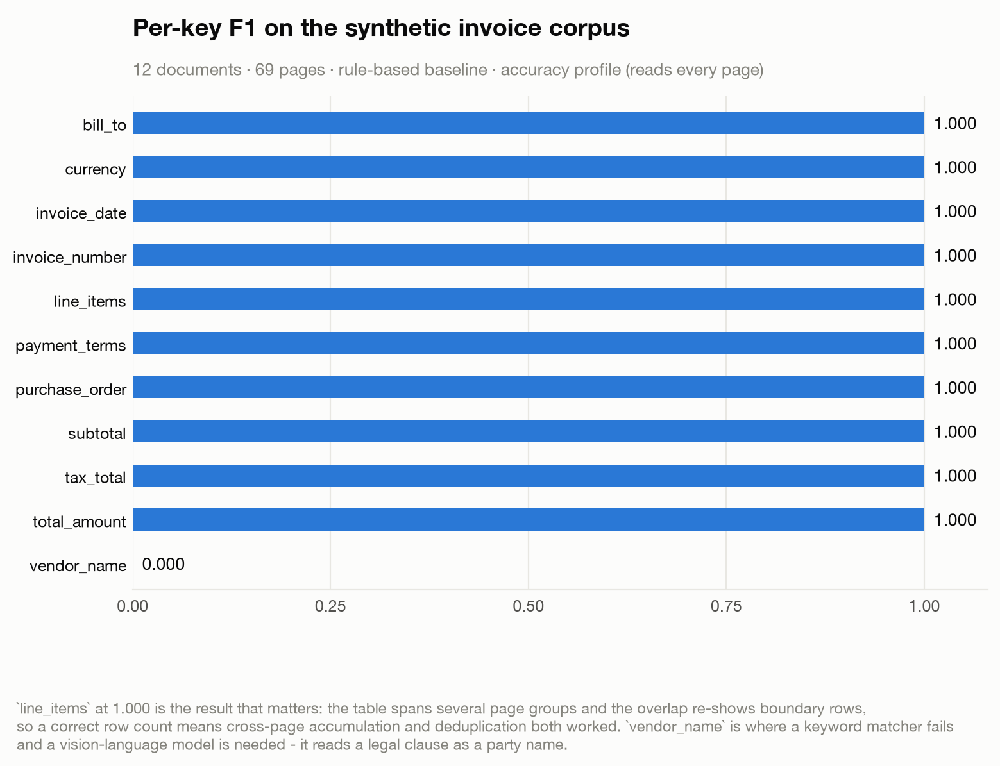

# Evaluation

Two kinds of number appear in this project, and conflating them would be dishonest, so
they are kept in separate files, separate figures, and separate sections here.

| | **Reported outcomes** | **Measured in this repository** |
|---|---|---|
| Source | Ricoh USA deployment, Sep–Dec 2025 | `make results`, run right now |
| Data | ~600 proprietary enterprise documents, 3.2K pages | 20 synthetic documents, 246 pages, in `examples/` |
| Model | Qwen2.5-VL-7B, LoRA fine-tuned, on SageMaker | Rule-based baseline backend (no model) |
| Reproducible here? | **No** | Yes |
| Files | `results/tables/deployment_*.csv` | `results/tables/measured_*.csv` |
| Figures | `reported_*.svg` | `measured_*.svg` |

**Nothing in this repository produced the reported numbers.** They are recorded for
provenance because they describe what the system did in production; the code here is a
clean-room implementation of that architecture, and the corpus it ships with is
synthetic.

---

## 1. Metrics

Four numbers, because extraction fails in four independent ways and one score hides
which is happening.

### Weighted F1

Support-weighted mean F1 across schema keys. Support-weighted rather than macro so a
schema with one always-present field and nine rare ones is not dominated by the rare
ones.

Matching is **type-aware**: currency compares numerically (`$1,240.00` == `1240.0`),
dates compare after normalisation (`2026-01-15` == `01/15/2026`), strings compare
case- and whitespace-insensitively. That is not leniency — it is refusing to score
formatting as if it were extraction.

Table rows match on `row_key_columns`; unmatched rows on either side are errors.

### Schema-valid output rate

Fraction of documents whose record passes validation with zero errors. A record that
is 90% correct but fails its contract cannot be written to a database, so this is
tracked separately from F1 rather than folded into it.

Warnings (unknown keys, dropped columns) do not invalidate a record.

### Cross-page field accuracy

Accuracy restricted to fields whose **gold evidence spans two or more pages**. This is
the metric page grouping and cross-page state exist to move, and it is precisely what
whole-document accuracy averages away — a system can look fine overall while losing
every value that requires stitching two pages together.

### Citation precision

Verified citations / emitted citations. A citation is verified when it resolves to a
layout block that supports the value (see the attribution ladder in
[`ARCHITECTURE.md`](ARCHITECTURE.md#7-evidence-attribution)). This separates "right"
from "right for a reason you can check".

---

## 2. Reported outcomes (Ricoh deployment)

> Measured internally at Ricoh USA on ~600 proprietary enterprise documents (3.2K
> pages) between September and December 2025. Not reproducible from this repository.

### LoRA fine-tuning

Qwen2.5-VL-7B, LoRA r=16, vision tower frozen, trained on **2.4K labelled page-group
sets** with task-specific structured extraction targets.

| Metric | Base | + LoRA | Δ |
|---|---:|---:|---:|
| Weighted F1 | 0.867 | **0.923** | +5.6 pts |
| Schema-valid output rate | 0.934 | **0.986** | +5.2 pts |


The schema-valid gain is the more operationally useful of the two: it is the difference
between 1 document in 15 needing a human and 1 in 70.

### Prompt and inference orchestration

Adding relevant-page retrieval and evidence attribution on top of single-pass
prompting.

| Metric | Before | After | Δ |
|---|---:|---:|---:|
| Cross-page field accuracy | 0.789 | **0.887** | +9.8 pts |
| Citation precision | 0.879 | **0.942** | +6.3 pts |


Cross-page accuracy moved most, which is the expected shape: it is the metric that
page-at-a-time prompting structurally cannot do well on.

### Productionised inference

OCR/prompt caching, bounded page-group processing, and validation-driven early exit:

| | |
|---|---:|
| Processing-time reduction | **20.2%** |
| Weighted-F1 gap vs the peak-accuracy configuration | **−0.3 pts** |

The pairing is the claim. A 20% speedup that costs five F1 points is not interesting;
one that costs 0.3 is a different decision.

---

## 3. Measured in this repository

Produced by `make results` over the synthetic corpus in `examples/`, using the
**rule-based baseline backend** — keyword and regex matching over the layout text, no
model. Absolute values are therefore low, and that is the point: this is the floor a
VLM is measured against, not a claim about the VLM.

### Corpus

| Schema | Documents | Pages | Pages/doc | Keys | Required |
|---|---:|---:|---:|---:|---:|
| `invoice` | 12 | 69 | 5.8 | 11 | 5 |
| `service_agreement` | 8 | 177 | 22.1 | 9 | 4 |

The two corpora exercise different halves of the system. Invoices have a **required
table that spans page groups**; agreements are **long, with no required table and key
terms buried at unpredictable depths**.

### Per-key F1 on invoices



`line_items` at 1.000 is the result that matters. The table spans several page groups
and the overlap re-shows boundary rows, so a correct row count on all 12 documents
means cross-page accumulation *and* row-key deduplication both worked.

`vendor_name` is the honest failure. A keyword matcher reads "property of the seller
until paid for in full" in a terms-and-conditions clause and returns it as the vendor
name. No amount of regex fixes that — telling a letterhead from a legal clause is
exactly what a vision-language model is for.

### The accuracy / coverage trade-off


On the 18–26 page agreements:

| Profile | Weighted F1 | Pages read | Schema-valid | Citation precision |
|---|---:|---:|---:|---:|
| `accuracy` | 0.364 | 100.0% | 1.000 | 1.000 |
| `balanced` | 0.281 | 31.6% | 1.000 | 1.000 |
| `fast` | 0.091 | 13.6% | 1.000 | 1.000 |

Read this as a curve, not a leaderboard. `balanced` reads **32% of the pages for 77% of
the accuracy ceiling**. Whether that is a good trade depends entirely on how strong the
backend is — with a weak extractor the pages it skips were carrying real information,
and the gap is wide. The reported deployment figure above (−0.3 F1 for 20.2% less time)
is the same trade with a fine-tuned model on the other end, and the gap is narrow. Both
are true; they are measuring the same mechanism at different backend strengths.

### On the invoice corpus, early exit never fires

All three profiles read 100% of pages and score identically (0.966 weighted F1). This
is `respect_open_tables` doing its job: `line_items` is required and stays open until
the last page, so stopping early would truncate it and the policy refuses. A profile
sweep that showed a speedup here would mean the guard was broken.

---

## 4. Reproducing

```bash
make results        # tables + figures
make sweep          # profile comparison, printed
make test           # 148 tests
```

Or directly:

```bash
throughline evaluate examples/corpus --schema invoice --profile accuracy
throughline sweep    examples/corpus_agreements --schema service_agreement
```

Every run logs to MLflow when it is installed — params from the `RunConfig`, headline
metrics, and per-key F1 as `f1/<key>` so a regression can be traced to the field that
caused it rather than the average that moved. Without MLflow the harness degrades to
structured log lines; an evaluation harness that cannot run without a tracking server
is a tracking server with an evaluation harness attached.

---

## 5. Limitations

- **The shipped corpus is synthetic.** It was written to exercise continuation,
  scattered fields and out-of-schema pages. It is not a distribution of real enterprise
  documents, and F1 on it does not predict F1 on yours.
- **The default backend is not a model.** Every number in §3 is a keyword-matching
  floor.
- **Cross-page accuracy needs multi-page gold evidence.** The agreement corpus labels
  single-page evidence for each key, so its cross-page metric reads 0/0. Only the
  invoice corpus exercises it (0.667).
- **The reported outcomes cannot be checked here.** They were measured on data that is
  not in this repository and will not be.
