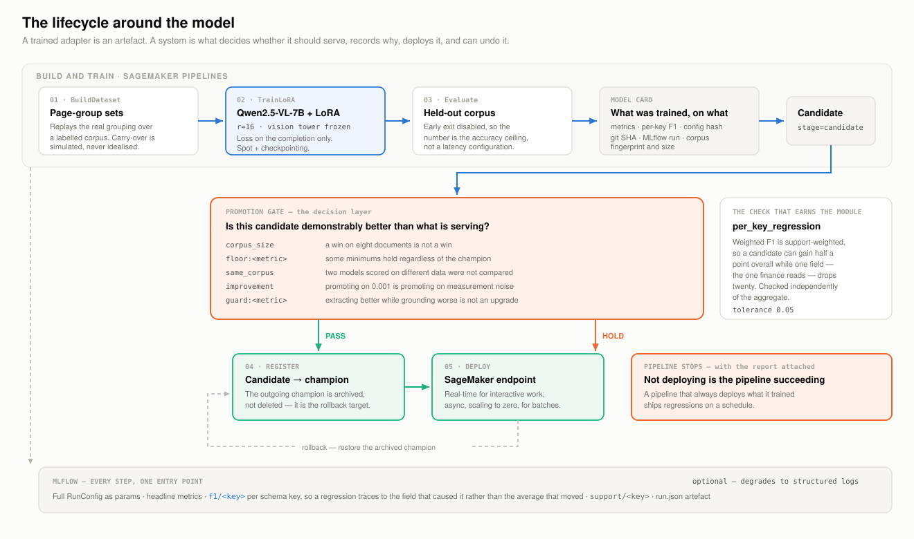

# MLOps: the lifecycle around the model

A trained adapter is an artefact. A system is what decides whether that artefact should
serve traffic, records why, deploys it, and can undo it. This document is that layer.



---

## 1. The shape of the problem

Model work fails operationally in ways that have nothing to do with the model:

| Failure | What it looks like |
|---|---|
| **The unrepeatable win** | A checkpoint scored well once. Nobody can say on what data, with which hyperparameters, from which commit. |
| **The invisible regression** | Aggregate F1 went up half a point. One field that finance reads collapsed. Nobody looked at per-field numbers. |
| **The invalid comparison** | Candidate and champion were scored on different corpora. The delta means nothing. |
| **The one-way door** | The new model is worse in production and there is no recorded path back to the old one. |
| **The pipeline that always ships** | Retraining is automated end to end, including deployment. It now ships regressions on a schedule. |

Each is addressed by a specific mechanism below, and each mechanism exists *because* of
the failure it prevents — not because a diagram had a box for it.

---

## 2. Orchestration, at three levels

The word "orchestration" covers three different things here. Keeping them distinct
matters, because they have different failure modes and different owners.

### Level 1 — within a document: the extraction orchestrator

**Module:** [`pipeline/orchestrator.py`](../src/throughline/pipeline/orchestrator.py)

Control flow over page groups: build prompt → generate → parse → attribute → merge →
ask the exit policy. Per-group `GroupTrace` records tokens, latency, cache hit, fields
added, rows added, citations claimed vs verified, repairs, and errors. A backend error
on one group is recorded and the run continues; a failing document in a batch is
isolated. `fail_fast=True` inverts both for debugging.

### Level 2 — around the model: the retraining pipeline

**Module:** [`training/pipeline.py`](../src/throughline/training/pipeline.py)

A SageMaker Pipelines DAG with a **conditional edge**:

```
BuildDataset ──▶ TrainLoRA ──▶ Evaluate ──▶ ⟨gate⟩ ──┬── pass ──▶ Register ──▶ Deploy
                                                      └── hold ──▶ Fail (with the report)
```

The conditional is the entire point. Steps run as separate Processing and Training jobs
so each is independently retryable, independently sized, and logged where the rest of
the platform's telemetry lives.

The DAG is built as a **backend-agnostic plan first** and rendered into SageMaker
objects second:

```bash
throughline pipeline --schema invoice --bucket my-bucket --out results/pipeline.json
```

`build_plan()` and `validate_plan()` are pure functions — no AWS SDK, no credentials.
That is what lets CI check the pipeline's *shape* on every commit, and a DAG change show
up as a reviewable JSON diff rather than as a surprise at 3 a.m. `validate_plan()`
explicitly fails a pipeline with **no condition step**, because that pipeline would
deploy unconditionally.

### Level 3 — around the platform: the Fork-Update Agent

**Module:** [`ops/fork_update_agent/`](../ops/fork_update_agent) ·
**Doc:** [`FORK_UPDATE_AGENT.md`](FORK_UPDATE_AGENT.md)

Step Functions over five Lambdas, keeping the fork of the accelerator's shared library
current and smoke-tested. Levels 2 and 3 are both Step Functions, and that is not a
coincidence — "detect a change, validate it, decide, deploy or stop" is the same shape
whether the change is a new adapter or a new upstream release.

---

## 3. Experiment tracking

**Module:** [`evaluation/mlflow_tracking.py`](../src/throughline/evaluation/mlflow_tracking.py)

Every evaluation run and every training job logs through one entry point, because
comparability is the whole value: a base checkpoint, a LoRA adapter, and a latency
configuration are scored by the same code on the same corpus, so a difference in the
numbers is a difference in the system rather than in how it was measured.

| Logged | Why |
|---|---|
| Full `RunConfig` as params | A run is described completely enough to repeat |
| Headline metrics | The five numbers worth a dashboard |
| **`f1/<key>` per schema key** | So a regression traces to the field that caused it, not the average that moved |
| `support/<key>` | Weighted F1 is support-weighted; the weights belong in the record |
| `run.json` artefact | Per-document results, exit reasons, traces |

MLflow is **optional**. Without it every function degrades to a structured log line. An
evaluation harness that cannot run without a tracking server is a tracking server with
an evaluation harness attached.

---

## 4. The model registry

**Module:** [`training/registry.py`](../src/throughline/training/registry.py)

A `ModelCard` is everything needed to judge, deploy, or reproduce one model: adapter
URI, base model, metrics, **per-key F1**, training config (and its hash), git SHA,
MLflow run id, corpus fingerprint, corpus size, and stage.

```
candidate ──gate──▶ champion ──superseded──▶ archived ──rollback──▶ champion
```

Deliberately **file-backed rather than a service**. The registry's job is to be the
single answer to "what is serving, and what did it score?", and a JSON file in version
control answers that from a laptop, from CI, and from a SageMaker job without anything
needing to be up. Point it at S3-synced storage for a team.

```bash
throughline registry                                  # the table
throughline registry --promote lora-r16-v3 --strict   # run the gate
throughline registry --rollback                       # restore the previous champion
```

```text
model        stage             F1   valid    cite   docs  created
--------------------------------------------------------------------
lora-r16-v1  archived       0.901   0.986   0.930    120  2026-11-02
lora-r16-v2  champion       0.923   0.986   0.942    120  2026-11-19
lora-r32-v3  candidate      0.931   0.986   0.860    120  2026-12-04
```

---

## 5. The promotion gate

The decision layer, and the piece most worth arguing about.

| Check | Blocks on | Exists because |
|---|---|---|
| `corpus_size` | Fewer than 25 documents | A win on eight documents is not a win |
| `floor:<metric>` | Below an absolute minimum | Some floors are non-negotiable regardless of the champion |
| `same_corpus` | Different corpus fingerprints | Two models scored on different data have not been compared |
| `improvement:<primary>` | Gain below `min_improvement` | Promoting on 0.001 is promoting on measurement noise |
| `guard:<metric>` | A guarded metric regressing | A model that extracts better but *grounds* worse is not an upgrade |
| `per_key_regression` | Any field dropping > tolerance | **A support-weighted mean can improve while one field collapses** |
| `key_coverage` | *(warning only)* | The candidate did not score keys the champion did |

The third row from the bottom is the one that earns the module. Consider the registry
table above — `lora-r32-v3` has the best weighted F1 of the three:

```text
$ throughline registry --promote lora-r32-v3

HOLD: lora-r32-v3 vs lora-r16-v2
  [PASS] corpus_size: scored on 120 documents (minimum 25)
  [FAIL] floor:citation_precision: 0.8600 vs floor 0.9000
  [PASS] floor:schema_valid_rate: 0.9860 vs floor 0.9500
  [PASS] same_corpus: candidate and champion scored on the same corpus
  [PASS] improvement:weighted_f1: 0.9230 → 0.9310 (+0.0080, need ≥ +0.0050)
  [PASS] guard:schema_valid_rate: 0.9860 → 0.9860 (-0.0000, tolerance 0.0100)
  [FAIL] guard:citation_precision: 0.9420 → 0.8600 (-0.0820, tolerance 0.0100)
  [PASS] per_key_regression: no field regressed beyond tolerance
```

Higher F1, held. It grounds 8 points worse, and in a system whose premise is that every
value is attributable, that is a downgrade wearing a better headline number. Exit code
1, so a CI job fails on it.

Two named profiles: `STRICT` for a system of record (clear win, regress almost nothing),
`PERMISSIVE` for early iteration when the champion is weak and movement matters more
than safety. `--force` promotes over a failed gate and **writes that fact into the model
card**, so an override is a recorded decision rather than an invisible one.

---

## 6. Deployment and rollback

Promotion updates the endpoint in place; the outgoing champion is **archived, not
deleted**, because it is the rollback target. A registry that cannot roll back is a
list.

```bash
throughline registry --rollback     # previous champion restored, current archived
```

Both cards record what happened and when, so the history reads forward.

---

## 7. Caching, and what it is really for

**Module:** [`caching/store.py`](../src/throughline/caching/store.py)

Two content-addressed caches — OCR keyed on source bytes, prompts keyed on
prompt + decoding config + backend name.

The obvious benefit is cost. The larger one is **iteration speed on everything that is
not the model**: changing the merge policy, the exit threshold, or the attribution
ladder changes no prompt, so re-running a corpus costs nothing in model calls. That is
what makes those parts of the system tunable at all.

Within a run it also deduplicates: the same invoice template filed 400 times hits the
same entries.

```bash
throughline cache --dir .cache/prompts        # entries and size
throughline cache --dir .cache/prompts --clear
```

---

## 8. What runs in CI

| Job | Checks |
|---|---|
| `test` | 189 tests on Python 3.10 and 3.12; ruff; the pipeline runs end to end with no model and no cloud |
| `hygiene` | No tracked `.env`; no file over 10 MB; the synthetic corpus regenerates deterministically |

The third hygiene check is the interesting one: `tools/make_examples.py` is
deterministic, so CI regenerates the corpus and fails if it differs from what is
committed. That is how the page-numbering gap in the agreement generator was caught —
the fixtures and their generator cannot silently drift apart.

---

## 9. Honest gaps

Named because a lifecycle diagram with no gaps is a diagram, not a system.

- **No shadow deployment.** Promotion updates the endpoint directly. A shadow stage —
  mirroring live traffic to the candidate and comparing outputs before cutting over —
  is the next thing worth building, and `Stage.STAGING` exists for it.
- **No drift detection.** Nothing watches the *input* distribution. A corpus that
  shifts toward a document type the model was not trained on degrades quality with every
  offline metric still looking fine.
- **No automated retraining trigger.** The DAG must be started by hand. Wiring it to a
  schedule or a data-volume threshold is straightforward; deciding *when* retraining is
  warranted is not, and shipping the trigger before the drift detection would be
  backwards.
- **Confidence is uncalibrated.** The early-exit threshold is relative, not absolute,
  until per-field confidence is mapped to observed accuracy.
